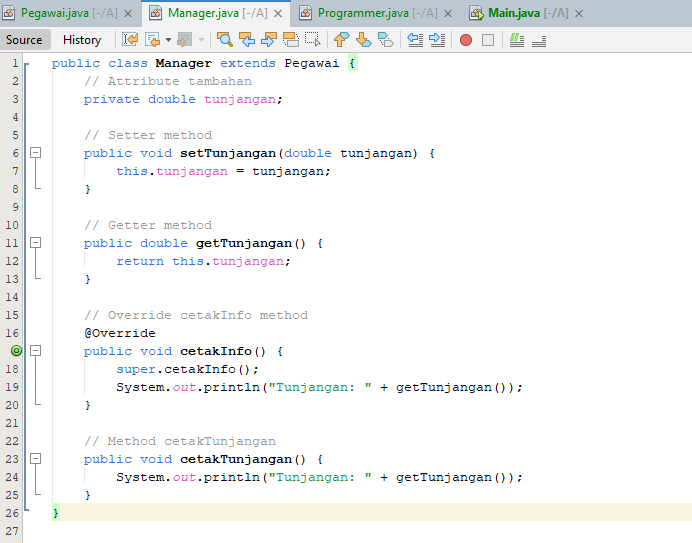

# Praktikum3

# *I* 

# Implementasinya

# Penjelasannya

# 1. *Class Manusia*
  # Atribut:
    • protected String nama;

    • protected String jenisKelamin;
  
    • protected int umur;

    • protected String alamat;

  # Penjelasan:
    • Class Manusia memiliki atribut yang mendeskripsikan informasi dasar tentang seorang manusia.

    • Protected artinya atribut ini bisa diakses oleh kelas yang mengextends (menurunkan) kelas ini (seperti Mahasiswa), tetapi tidak bisa diakses langsung dari luar kelas.

  # Getter dan Setter:
    • Metode getNama(), setNama(String nama), dll. adalah metode akses (getter dan setter) untuk atribut-atribut kelas Manusia.

    • Getter digunakan untuk mengambil nilai dari atribut, sedangkan Setter digunakan untuk memberikan nilai kepada atribut.

    • Menggunakan getter dan setter adalah praktik baik dalam OOP untuk menjaga enkapsulasi.

# 2. *Class Mahasiswa*
  # Inheritance:
    • public class Mahasiswa extends Manusia artinya kelas Mahasiswa mewarisi semua atribut dan metode dari kelas Manusia.

  # Atribut Tambahan:
    • private String nim;

    • private String jurusan;

  # Penjelasan:
    • Class ini memiliki dua atribut tambahan yang spesifik untuk mahasiswa: nim (nomor induk mahasiswa) dan jurusan.

    • Private berarti atribut ini hanya bisa diakses dalam kelas Mahasiswa dan tidak bisa diakses langsung dari luar.

  # Getter dan Setter untuk Atribut Tambahan:
    • Seperti pada kelas Manusia, ada metode getter dan setter untuk nim dan jurusan.

  # Metode cetakInfo():
    • Metode ini bertanggung jawab untuk mencetak semua informasi mahasiswa, termasuk yang diwarisi dari kelas Manusia.

    • Menggunakan getter untuk mendapatkan nilai dari atribut, metode ini mencetak informasi mahasiswa ke konsol.

# 3. *Class MahasiswaBeraksi*
  # Method main:
    • Merupakan titik masuk (entry point) program. Di sinilah eksekusi program dimulai.

  # Membuat Objek Mahasiswa:
    • Mahasiswa anton = new Mahasiswa(); membuat instance baru dari kelas Mahasiswa dengan nama anton.

  # Mengisi Data:
    • Menggunakan setter (misalnya, anton.setNim("10102020");), kita memberi nilai pada atribut-atribut objek anton.

  # Mencetak Informasi:
    • anton.cetakInfo(); memanggil metode cetakInfo() dari objek anton, yang mencetak informasi lengkap tentang mahasiswa ke konsol.

# Hasil Output

# Prinsip OOP yang Diterapkan

  # 1. *Encapsulation (Enkapsulasi):*
    • Dengan menggunakan getter dan setter, kita menjaga agar akses ke atribut terbatas dan dapat mengontrol cara data diubah atau diambil.

  # 2. *Inheritance (Pewarisan):*
    • Class Mahasiswa mewarisi atribut dan metode dari kelas Manusia, memungkinkan kita untuk mengelompokkan fitur umum (seperti nama, jenis kelamin, umur, dan alamat) di kelas dasar, dan menambahkan fitur khusus di kelas turunan.

  # 3. *Abstraction (Abstraksi):*
    • Penggunaan metode seperti cetakInfo() menyembunyikan detail implementasi dan hanya menampilkan informasi yang relevan.

# *II*

# Implementasinya

# Penjelasannya
  

  # 1. *Class Pegawai*
    • Pegawai adalah superclass atau kelas induk yang mendefinisikan atribut umum bagi semua pegawai, yaitu nama dan gajiPokok.

    • Method setter digunakan untuk mengatur nilai dari nama dan gajiPokok, sementara method getter digunakan untuk mengambil nilai dari atribut tersebut.

    • cetakInfo() adalah method yang menampilkan informasi pegawai berupa nama dan gaji pokok. Method ini nantinya bisa di-override oleh subclass jika diperlukan.

  
  # 2. *Class Manager*
    • Manager adalah subclass dari Pegawai. Kelas ini memiliki atribut tambahan, yaitu tunjangan.

    • Method cetakInfo() di override pada kelas Manager untuk menambahkan informasi mengenai tunjangan di samping nama dan gaji pokok (yang berasal dari superclass Pegawai).

    • setTunjangan() dan getTunjangan() adalah method setter dan getter untuk mengatur serta mengambil nilai tunjangan dari objek Manager.

  # 3. *Class Programmer*
    • Programmer adalah subclass dari Pegawai, serupa dengan Manager. Namun, alih-alih tunjangan, kelas ini memiliki atribut tambahan yaitu bonus.

    • setBonus() dan getBonus() digunakan untuk mengatur dan mengambil nilai bonus.

    • Method cetakInfo() juga di override di kelas Programmer untuk menampilkan informasi bonus, selain nama dan gaji pokok yang diwarisi dari Pegawai.

  # 4. *Class Main*
    • Class ini adalah tempat di mana eksekusi program dimulai.

    • Pada method main(), kita membuat objek dari kelas Manager dan Programmer, lalu mengatur nilai atribut mereka menggunakan method setter.

    • Kemudian, kita memanggil method cetakInfo() untuk menampilkan informasi mengenai objek tersebut di console.

# Cara Kerja Program
  # Membuat Objek Manager:
    • Program pertama-tama membuat objek Manager dengan nama Budi. Gaji pokoknya diatur sebesar 8.000.000 dan tunjangannya 2.000.000 menggunakan method setter.
    
    • Setelah semua nilai diatur, method cetakInfo() dipanggil. Karena Manager meng-override method ini, informasi yang ditampilkan meliputi Nama, Gaji Pokok, dan Tunjangan.

  # Membuat Objek Programmer:
    • Objek kedua yang dibuat adalah Programmer dengan nama Andi. Gaji pokoknya diatur sebesar 10.000.000 dan bonusnya 1.500.000.

    • Seperti objek Manager, method cetakInfo() pada Programmer juga dipanggil. Method ini menampilkan Nama, Gaji Pokok, dan Bonus.

  # 3. *Penjelasan Output*
  # Ketika program dijalankan, output berikut dihasilkan:

  
  # Untuk objek Manager:
    • Nama: Budi
   
    • Gaji Pokok: 8.000.000
    
    • Tunjangan: 2.000.000
    
    • Output ini dihasilkan dari method cetakInfo() yang memanggil method dari superclass (Pegawai) untuk menampilkan Nama dan Gaji Pokok, kemudian menambahkan Tunjangan dari subclass Manager.

  # Untuk objek Programmer:
    • Nama: Andi
   
    • Gaji Pokok: 10.000.000
    
    • Bonus: 1.500.000
    
    • Sama seperti Manager, method cetakInfo() di Programmer juga memanggil method superclass untuk menampilkan Nama dan Gaji Pokok, serta menambahkan Bonus dari subclass Programmer.

# 4. *Konsep OOP yang Digunakan*
  # Inheritance (Pewarisan):
    • Manager dan Programmer mewarisi atribut dan method dari kelas induk Pegawai. Ini menunjukkan konsep pewarisan, di mana subclass dapat menggunakan atribut dan method dari superclass-nya.

  # Encapsulation (Enkapsulasi):
    • Atribut-atribut pada kelas seperti nama, gajiPokok, tunjangan, dan bonus bersifat private dan hanya dapat diakses melalui method getter dan setter. Ini menunjukkan bahwa data dilindungi dan hanya dapat diakses melalui method tertentu.

  # Polymorphism (Polimorfisme):
    • Method cetakInfo() di subclass Manager dan Programmer meng-override method cetakInfo() yang ada di superclass Pegawai. Polimorfisme terjadi ketika method yang sama (dalam hal ini cetakInfo) berperilaku berbeda untuk objek yang berbeda (Manager dan Programmer).

