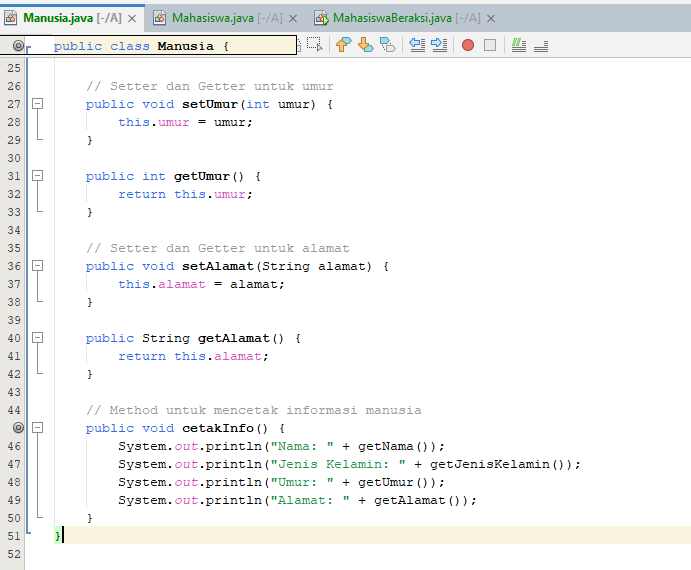

# Praktikum3

# Implementasinya

# Penjelasannya

# 1 *Class Manusia*
  # Atribut:
    • protected String nama;

    • protected String jenisKelamin;
  
    • protected int umur;

    • protected String alamat;

  # Penjelasan:
    • Class Manusia memiliki atribut yang mendeskripsikan informasi dasar tentang seorang manusia.

    • Protected artinya atribut ini bisa diakses oleh kelas yang mengextends (menurunkan) kelas ini (seperti Mahasiswa), tetapi tidak bisa diakses langsung dari luar kelas.

  # Getter dan Setter:
    • Metode getNama(), setNama(String nama), dll. adalah metode akses (getter dan setter) untuk atribut-atribut kelas Manusia.

    • Getter digunakan untuk mengambil nilai dari atribut, sedangkan Setter digunakan untuk memberikan nilai kepada atribut.

    • Menggunakan getter dan setter adalah praktik baik dalam OOP untuk menjaga enkapsulasi.

# 2. *Class Mahasiswa*
  # Inheritance:
    • public class Mahasiswa extends Manusia artinya kelas Mahasiswa mewarisi semua atribut dan metode dari kelas Manusia.

  # Atribut Tambahan:
    • private String nim;

    • private String jurusan;

  # Penjelasan:
    • Class ini memiliki dua atribut tambahan yang spesifik untuk mahasiswa: nim (nomor induk mahasiswa) dan jurusan.

    • Private berarti atribut ini hanya bisa diakses dalam kelas Mahasiswa dan tidak bisa diakses langsung dari luar.

  # Getter dan Setter untuk Atribut Tambahan:
    • Seperti pada kelas Manusia, ada metode getter dan setter untuk nim dan jurusan.

  # Metode cetakInfo():
    • Metode ini bertanggung jawab untuk mencetak semua informasi mahasiswa, termasuk yang diwarisi dari kelas Manusia.

    • Menggunakan getter untuk mendapatkan nilai dari atribut, metode ini mencetak informasi mahasiswa ke konsol.

# 3. *Class MahasiswaBeraksi*
  # Method main:
    • Merupakan titik masuk (entry point) program. Di sinilah eksekusi program dimulai.

  # Membuat Objek Mahasiswa:
    • Mahasiswa anton = new Mahasiswa(); membuat instance baru dari kelas Mahasiswa dengan nama anton.

  # Mengisi Data:
    • Menggunakan setter (misalnya, anton.setNim("10102020");), kita memberi nilai pada atribut-atribut objek anton.

  # Mencetak Informasi:
    • anton.cetakInfo(); memanggil metode cetakInfo() dari objek anton, yang mencetak informasi lengkap tentang mahasiswa ke konsol.

# Hasil Output

# Prinsip OOP yang Diterapkan

  # 1 *Encapsulation (Enkapsulasi):*
    • Dengan menggunakan getter dan setter, kita menjaga agar akses ke atribut terbatas dan dapat mengontrol cara data diubah atau diambil.

  # 2 *Inheritance (Pewarisan):*
    • Class Mahasiswa mewarisi atribut dan metode dari kelas Manusia, memungkinkan kita untuk mengelompokkan fitur umum (seperti nama, jenis kelamin, umur, dan alamat) di kelas dasar, dan menambahkan fitur khusus di kelas turunan.

  # 3 *Abstraction (Abstraksi):*
    • Penggunaan metode seperti cetakInfo() menyembunyikan detail implementasi dan hanya menampilkan informasi yang relevan.

Pegawai.Java.png

Programmer.Java.png

Main.Java.png

Manager.Java.png
